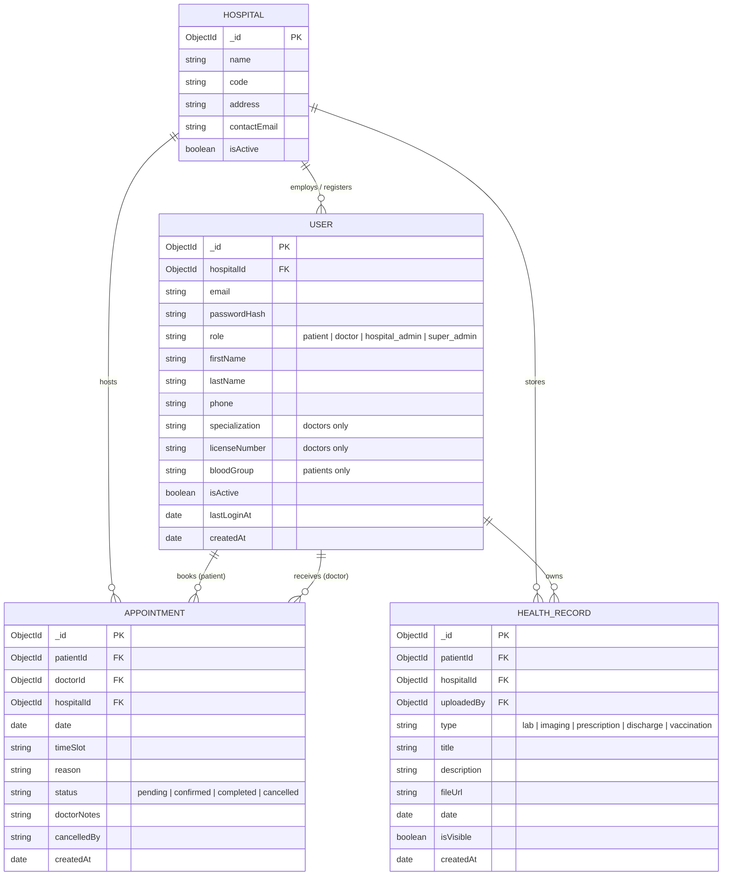

# Healthcare Web Platform

A full-stack collaborative healthcare management platform built with the MERN stack, featuring real-time WebSocket sync and offline-first capabilities via IndexedDB.

[](https://github.com/YOUR_USERNAME/healthcare-web-platform/actions/workflows/ci.yml)

> **⚠️ Replace `YOUR_USERNAME` in the badge URL above with your actual GitHub username.**

---

## Architecture Overview

```
┌──────────────────────────────────────────────────────────────────────┐
│                         CLIENT (React + Vite)                        │
│                                                                      │
│  ┌──────────────┐  ┌──────────────┐  ┌────────────────────────────┐ │
│  │ AuthContext  │  │SocketContext │  │  Dexie IndexedDB (offline) │ │
│  └──────────────┘  └──────────────┘  └────────────────────────────┘ │
│         │                 │                        │                 │
│         ▼                 ▼                        ▼                 │
│  ┌──────────────────────────────────────────────────────────────┐   │
│  │              Pages: Patient / Doctor / Admin                 │   │
│  └──────────────────────────────────────────────────────────────┘   │
└──────────────────────────────────────────────────────────────────────┘
              │ REST (axios)               │ WebSocket (socket.io)
              ▼                           ▼
┌──────────────────────────────────────────────────────────────────────┐
│                    SERVER (Node.js + Express)                        │
│                                                                      │
│  ┌───────────┐ ┌───────────┐ ┌──────────────┐ ┌─────────────────┐  │
│  │ authRoutes│ │appt Routes│ │healthRec Rts │ │  adminRoutes    │  │
│  └───────────┘ └───────────┘ └──────────────┘ └─────────────────┘  │
│                                                                      │
│  ┌─────────────────────────┐    ┌─────────────────────────────────┐ │
│  │  JWT Auth Middleware     │    │  Socket.io (hospital/doctor     │ │
│  │  (bcryptjs + jsonwebtoken│    │   rooms for live sync)          │ │
│  └─────────────────────────┘    └─────────────────────────────────┘ │
└──────────────────────────────────────────────────────────────────────┘
              │ Mongoose ODM
              ▼
┌──────────────────────────────────────────────────────────────────────┐
│                    MongoDB Atlas (Cloud)                             │
│           Users · Appointments · HealthRecords · Hospitals           │
└──────────────────────────────────────────────────────────────────────┘
```

---

## Database Schema



---

## REST API Reference

> 📂 **Full Postman Collection:** [`docs/postman_collection.json`](./docs/postman_collection.json) — import into Postman to test every endpoint interactively.

| Method   | Endpoint                              | Auth     | Description                     |
|----------|---------------------------------------|----------|---------------------------------|
| `POST`   | `/api/auth/register`                  | Public   | Register a new user             |
| `POST`   | `/api/auth/login`                     | Public   | Login and receive JWT tokens    |
| `POST`   | `/api/auth/refresh`                   | Public   | Refresh the access token        |
| `POST`   | `/api/auth/logout`                    | 🔒 JWT   | Logout and invalidate token     |
| `GET`    | `/api/auth/me`                        | 🔒 JWT   | Get the current user's profile  |
| `POST`   | `/api/appointments`                   | 🔒 Patient | Book a new appointment        |
| `GET`    | `/api/appointments/my`                | 🔒 Patient | Get my appointments           |
| `PATCH`  | `/api/appointments/:id/status`        | 🔒 Doctor/Patient | Update status + conflict detection via `version` field |
| `GET`    | `/api/appointments/doctor/queue`      | 🔒 Doctor | Get today's patient queue      |
| `GET`    | `/api/appointments/doctor/schedule`   | 🔒 Doctor | Get full upcoming schedule     |
| `GET`    | `/api/appointments/slots`             | 🔒 JWT   | Get available time slots        |
| `GET`    | `/api/health-records`                 | 🔒 JWT   | Get health records              |
| `POST`   | `/api/health-records`                 | 🔒 Doctor | Create a health record         |
| `GET`    | `/api/doctors`                        | 🔒 JWT   | List doctors in hospital        |
| `GET`    | `/api/admin/stats`                    | 🔒 Admin | Hospital dashboard stats        |
| `GET`    | `/api/health`                         | Public   | API health check                |

---

## WebSocket Events (Socket.io)

| Event                    | Direction         | Description                               |
|--------------------------|-------------------|-------------------------------------------|
| `join_hospital_room`     | Client → Server   | Join hospital broadcast room              |
| `join_doctor_room`       | Client → Server   | Join personal doctor room                 |
| `appointment:new`        | Server → Client   | Broadcast when new appointment is booked  |
| `appointment:updated`    | Server → Client   | Broadcast when appointment status changes |
| `appointment:conflict`   | Server → Client   | Broadcast when a concurrent edit conflict is detected (optimistic locking) |

---

## Features

- **Multi-role authentication** — Patient, Doctor, Hospital Admin, Super Admin
- **JWT + Refresh Token** — Secure stateless auth with token rotation
- **Real-time sync** — Live appointment queue updates via Socket.io
- **Offline-first** — Dexie/IndexedDB caches data; sync queue replays mutations when back online
- **Health Vault** — Patients can view lab reports, imaging, prescriptions, and discharge summaries
- **Doctor Queue** — Real-time triage queue with live status updates

---

## Getting Started

### Prerequisites
- Node.js v18+
- MongoDB Atlas account (or local MongoDB)
- Docker & Docker Compose (for containerized setup)

### Local Development

**1. Clone the repo**
```bash
git clone https://github.com/YOUR_USERNAME/healthcare-web-platform.git
cd healthcare-web-platform
```

**2. Configure the server**
```bash
cd server
cp .env.example .env   # Then fill in MONGO_URI and JWT secrets
npm install
npm run dev            # Starts on http://localhost:5000
```

**3. Configure the client**
```bash
cd ../client
npm install
npm run dev            # Starts on http://localhost:5173
```

### Docker (Full Stack)

```bash
# From the project root:
docker-compose up --build
```

- **Client:** http://localhost
- **Server API:** http://localhost:5000/api/health

> [!IMPORTANT]
> Set the `MONGO_URI` environment variable in `docker-compose.yml` or in a `.env` file before running Docker.

---

## Running Tests

```bash
# Server tests (Jest + Supertest)
cd server && npm test

# Client tests (Jest)
cd client && npm test
```

---

## CI/CD

GitHub Actions runs automatically on every push to `main`/`master`. The pipeline:
1. Installs dependencies for both server and client
2. Runs all server API tests
3. Runs all client unit tests
4. Verifies the client production build succeeds

To enable the server tests to connect to MongoDB Atlas in CI, add a `MONGO_URI` secret in your GitHub repository settings:
> **GitHub Repo → Settings → Secrets and Variables → Actions → New repository secret**
> Name: `MONGO_URI`, Value: your Atlas connection string

---

## Deployment

> **Deployed URL:** *(Add your live URL here after deployment)*

Recommended free deployment options:
- **Client:** [Vercel](https://vercel.com) or [Netlify](https://netlify.com)
- **Server:** [Railway](https://railway.app) or [Render](https://render.com)
- **Database:** [MongoDB Atlas](https://www.mongodb.com/cloud/atlas) (Free M0 tier)

---

## Team

| Member | Role |
|--------|------|
| *(Member 1 Name)* | Full-Stack Lead — React UI, Express routes, MongoDB schema design |
| *(Member 2 Name)* | Backend & Auth — JWT auth, Mongoose models, server tests (Jest/Supertest) |
| *(Member 3 Name)* | Frontend & Offline — React components, Dexie IndexedDB, client tests |
| *(Member 4 Name)* | DevOps & Real-Time — Docker Compose, GitHub Actions CI, Socket.io integration |

> Update member names and roles before submission.

---

## Known Limitations

- **File uploads** — health record `fileUrl` is a plain string; actual file upload/storage (e.g. to S3) is not implemented. A URL to an existing file must be provided.
- **Super admin hospital creation UI** — the super admin dashboard is backend-only; there is no dedicated React page for creating hospitals (must use the seed script or a REST client).
- **Conflict detection is advisory** — optimistic locking detects version mismatches and returns a 409, but the frontend does not yet display a merge UI; the user is prompted to refresh.
- **No email verification** — users can register without verifying their email address.
- **Socket.io auth is pass-through** — the socket middleware checks for the presence of a token but does not fully verify its signature (Phase 2 upgrade).
- **No rate limiting** — the API has no per-IP rate limiting in place; recommended before production deployment.

---

## Team Reflection

*(Add your one-page team reflection here before final submission — what worked, what you'd do differently, and how work was divided.)*

---

## Tech Stack

| Layer | Technology |
|-------|-----------|
| Frontend | React 19, Vite, React Router v7 |
| Styling | Tailwind CSS v4 |
| Offline | Dexie.js (IndexedDB) |
| Real-Time | Socket.io Client |
| Backend | Node.js, Express 5 |
| Auth | JWT (jsonwebtoken), bcryptjs |
| Database | MongoDB Atlas, Mongoose |
| Testing | Jest, Supertest, @testing-library/react |
| CI | GitHub Actions |
| DevOps | Docker, Docker Compose |
